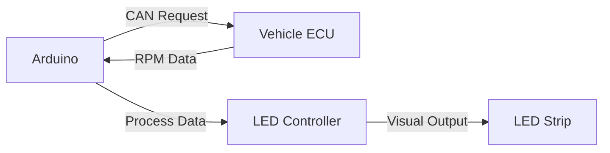

# 🚗⚡ OBD2 RPM LED Visualizer

<div align="center">


*Transform your car's RPM data into a stunning visual experience! 🌈*

[🚀 Features](#-features) • [🔧 Installation](#-installation) • [📹 Demo](#-demo) • [⚙️ Configuration](#️-configuration) • [🤝 Contributing](#-contributing)

</div>

---

## 🌟 What is This?

Ever wanted to see your engine's RPM in real-time with a cool LED strip? This project reads OBD2 data directly from your BMW or Mazda and creates a **dynamic RPM tachometer** using WS2813 addressable LEDs!

### 🎯 **The Magic**
- **Real-time RPM visualization** 📊
- **Color-coded performance zones** 🌈
- **Warning blinks at redline** ⚠️
- **Plug-and-play OBD2 connection** 🔌

---

## 🚀 Features

### 🎨 **Visual Excellence**
- **Gradient LED Display**: Smooth yellow-to-red gradient showing RPM progression
- **Dynamic Scaling**: Automatically maps RPM range to LED strip length
- **Redline Warning**: Blinks when approaching engine limits
- **Engine Off Detection**: Smart power management when engine stops

### 🔧 **Technical Prowess**
- **OBD2 Protocol Support**: Standard 11-bit and extended 29-bit addressing
- **CAN Bus Communication**: Direct vehicle network integration
- **Configurable Environments**: Test and production modes
- **FastLED Integration**: Optimized for WS2813 LED strips

### 🚙 **Vehicle Compatibility**
- ✅ **BMW**: All models with OBD2 (1996+)
- ✅ **Mazda**: All models with OBD2 (1996+)
- ✅ **Other Brands**: Most vehicles with standard OBD2 support

---

## 📹 Demo

https://github.com/Arsalan134/OBD2-RPM-Visualizer/assets/your-video/rpm.mp4

*Watch your engine come to life with real-time RPM visualization!*

---

## 🔧 Installation

### 📦 **Hardware Requirements**
```
🔹 Arduino Uno/Nano
🔹 MCP2515 CAN Bus Module  
🔹 WS2813 LED Strip (9+ LEDs)
🔹 OBD2 to DB9 Cable
🔹 12V Power Supply
🔹 Jumper Wires
```

### 🔌 **Wiring Diagram**
```
Arduino Uno    →    MCP2515 CAN Module
---------           ------------------
VCC (5V)       →    VCC
GND            →    GND  
Pin 10         →    CS
Pin 11         →    SI
Pin 12         →    SO
Pin 13         →    SCK
Pin 2          →    INT

Arduino Pin 3  →    LED Strip Data Pin
12V Supply     →    LED Strip Power (V+/GND)
```

### 💾 **Software Setup**

1. **Clone the repository**
   ```bash
   git clone https://github.com/Arsalan134/OBD2-RPM-Visualizer.git
   cd OBD2-RPM-Visualizer
   ```

2. **Install PlatformIO** (if not already installed)
   ```bash
   pip install platformio
   ```

3. **Build and Upload**
   ```bash
   pio run --target upload
   ```

4. **Monitor Serial Output**
   ```bash
   pio device monitor --baud 9600
   ```

---

## ⚙️ Configuration

### 🧪 **Environment Modes**

**Test Mode** (Default - Perfect for bench testing)
```cpp
#define isTesting  // Comment out for production

// Test Environment Settings:
RPM_MIN: 500        // Start visualization at 500 RPM
RPM_MAX: 2000       // Full scale at 2000 RPM  
BLINK_THRESHOLD: 1500  // Warning blinks at 1500 RPM
```

**Production Mode** (Real driving conditions)
```cpp
// #define isTesting  // Commented out for production

// Production Environment Settings:
RPM_MIN: 3000       // Start visualization at 3000 RPM
RPM_MAX: 5000       // Full scale at 5000 RPM
BLINK_THRESHOLD: 5200  // Warning blinks at 5200 RPM
```

### 🎛️ **Customization Options**

| Parameter | Description | Range |
|-----------|-------------|-------|
| `NUM_LEDS` | Number of LEDs in strip | 1-255 |
| `LED_MAX_BRIGHTNESS` | Maximum LED brightness | 0-255 |
| `BLINK_DURATION` | Warning blink speed (ms) | 25-500 |
| `RPM_MIN/MAX` | RPM visualization range | 0-8000 |

---

## 🛠️ Troubleshooting

### 🚨 **Common Issues**

**Problem**: "Starting CAN failed!"
```
✅ Solution: Check MCP2515 wiring and SPI connections
✅ Verify 5V power supply to CAN module
✅ Ensure OBD2 cable is properly connected
```

**Problem**: No LED response
```  
✅ Check LED strip power (needs 12V for WS2813)
✅ Verify data pin connection (Pin 3)
✅ Test with lower LED count first
```

**Problem**: Wrong RPM values
```
✅ Switch between standard/extended addressing mode
✅ Check vehicle OBD2 compatibility
✅ Verify CAN bus speed (usually 500kbps)
```

---

## 🎯 How It Works

### 📡 **OBD2 Communication Flow**


### 🧮 **RPM Processing**
1. **Query Engine**: Send OBD2 PID 0x0C request
2. **Receive Data**: Parse CAN bus response  
3. **Calculate RPM**: `((byte1 * 256) + byte2) / 4`
4. **Map to LEDs**: Scale RPM to LED position
5. **Apply Colors**: Gradient from yellow to red
6. **Update Display**: Real-time visual feedback

---

## 🤝 Contributing

We love contributions! Here's how you can help:

### 🛠️ **Development Areas**
- 🚗 Add support for more vehicle brands
- 🎨 Create new LED animation patterns  
- 📊 Implement additional OBD2 PIDs
- 🔧 Optimize CAN bus performance
- 📱 Build companion mobile app

### 📝 **How to Contribute**
1. Fork the repository
2. Create feature branch (`git checkout -b feature/awesome-feature`)
3. Commit changes (`git commit -m 'Add awesome feature'`)
4. Push to branch (`git push origin feature/awesome-feature`)
5. Open Pull Request

---

## 📄 License

This project is licensed under the **MIT License** - see the [LICENSE](LICENSE) file for details.

---

## 🙋‍♂️ Author

**Arsalan Iravani**
- 🔗 LinkedIn: [@airavani](https://www.linkedin.com/in/airavani/)
- 📧 Email: [airavani2018@gmail.com]


---

## 🚀 About Me

I'm an **iOS Developer** and **Electronics Enthusiast** passionate about bridging the gap between software and hardware. This project combines my love for automotive technology with embedded systems programming.

**Other Interests**: 📱 Mobile Development • 🛩️ Drone Technology • 🏎️ Automotive Electronics • 🤖 IoT Solutions

---

<div align="center">

### 🌟 **Star this repo if you found it helpful!** 🌟

**Made with ❤️ and lots of ☕**

</div>
